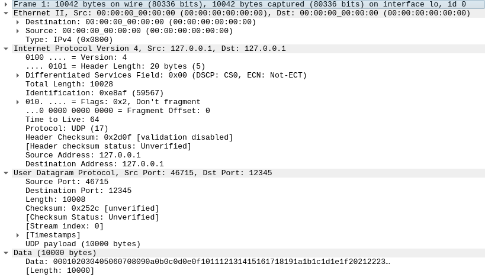

This project is a sample to send and receive data over UDP (on localhost) using
UDP segmentation:
 - the server sends 10000 bytes in a single `sendmsg()` call using segments of
   1200 bytes;
 - the client correctly receives 9 separate UDP packets for a total of 10000
   bytes (8 packets of 1200 bytes and one of 400 bytes).

It has been written in the context of this [issue] on the [Quinn] project.

[issue]: https://github.com/quinn-rs/quinn/issues/1572
[Quinn]: https://github.com/quinn-rs/quinn

## Build & run

```bash
gcc server.c -o server
gcc client.c -o client
```

Start the server and keep it running:

```bash
./server  # interrupt with Ctrl+c to stop it
```

It listens for UDP packets on port 12345.

Execute the client in a separate terminal, it will immediately send the data to
localhost:12345:

```
./client
```

## Expected results

```console
$ ./client
10000 bytes sent (segment_size=1200)
```

```console
$ ./server
Received datagram (1200 bytes)
Received datagram (1200 bytes)
Received datagram (1200 bytes)
Received datagram (1200 bytes)
Received datagram (1200 bytes)
Received datagram (1200 bytes)
Received datagram (1200 bytes)
Received datagram (1200 bytes)
Received datagram (400 bytes)
^C
```

## Wireshark

More surprisingly, [Wireshark] sees only 1 UDP packet (it does not see
individual packets):

[Wireshark]: https://en.wikipedia.org/wiki/Wireshark



```
Frame 1: 10042 bytes on wire (80336 bits), 10042 bytes captured (80336 bits) on interface lo, id 0
Ethernet II, Src: 00:00:00_00:00:00 (00:00:00:00:00:00), Dst: 00:00:00_00:00:00 (00:00:00:00:00:00)
    Destination: 00:00:00_00:00:00 (00:00:00:00:00:00)
    Source: 00:00:00_00:00:00 (00:00:00:00:00:00)
    Type: IPv4 (0x0800)
Internet Protocol Version 4, Src: 127.0.0.1, Dst: 127.0.0.1
    0100 .... = Version: 4
    .... 0101 = Header Length: 20 bytes (5)
    Differentiated Services Field: 0x00 (DSCP: CS0, ECN: Not-ECT)
    Total Length: 10028
    Identification: 0xe8af (59567)
    010. .... = Flags: 0x2, Don't fragment
    ...0 0000 0000 0000 = Fragment Offset: 0
    Time to Live: 64
    Protocol: UDP (17)
    Header Checksum: 0x2d0f [validation disabled]
    [Header checksum status: Unverified]
    Source Address: 127.0.0.1
    Destination Address: 127.0.0.1
User Datagram Protocol, Src Port: 46715, Dst Port: 12345
    Source Port: 46715
    Destination Port: 12345
    Length: 10008
    Checksum: 0x252c [unverified]
    [Checksum Status: Unverified]
    [Stream index: 0]
    [Timestamps]
    UDP payload (10000 bytes)
Data (10000 bytes)
    Data: 000102030405060708090a0b0c0d0e0f101112131415161718191a1b1c1d1e1f20212223…
    [Length: 10000]
```
